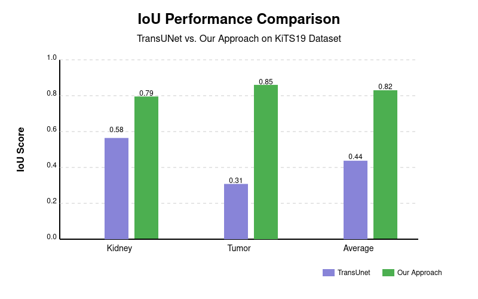
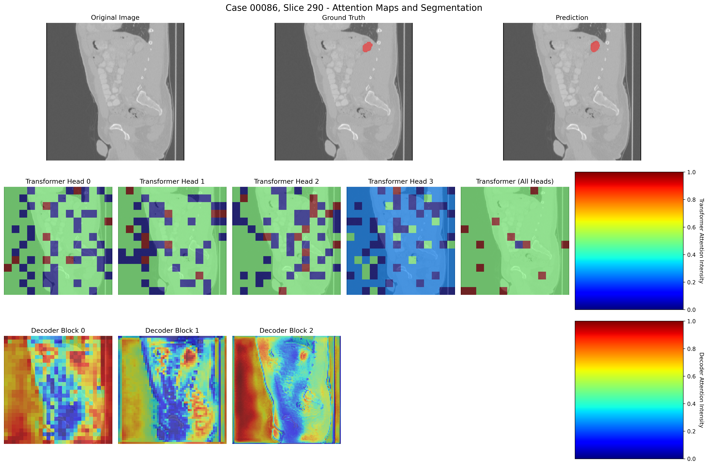
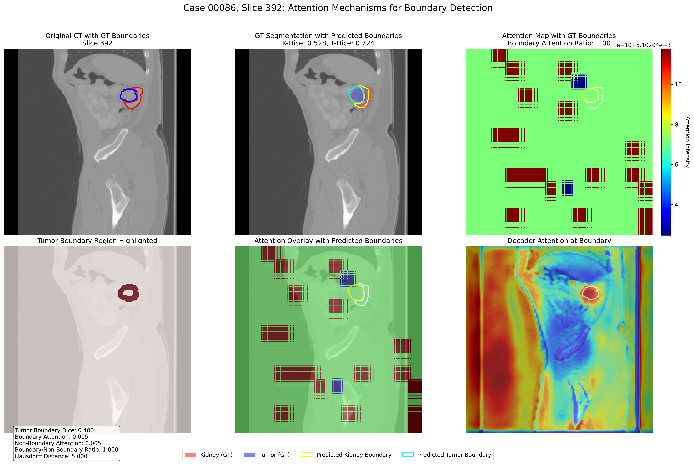

# Kidney Tumor Segmentation using TransUNet with Attention Gates

This project implements an enhanced version of the TransUNet architecture for kidney tumor segmentation, incorporating Attention Gates for improved segmentation accuracy. The implementation is trained and evaluated on the KiTS19 (Kidney Tumor Segmentation) dataset, providing robust segmentation of kidneys and tumors from CT scans.

## Key Features

- **Enhanced TransUNet Architecture**: Combines transformer-based global attention with UNet's local feature extraction capabilities
- **Attention Gate Integration**: Focuses on relevant regions in the input image, improving boundary detection and segmentation performance
- **Multi-loss Training**: Employs a combination of Cross-Entropy, Dice, Focal, and Boundary Loss for optimized training
- **Advanced Visualization Tools**: Comprehensive tools for visualizing attention maps, error analysis, and boundary detection
- **Weights & Biases Integration**: Full experiment tracking with metrics, attention maps, and segmentation outputs
- **Extensive Analysis Framework**: Tools for error analysis, model comparison, and boundary accuracy assessment
- **KiTS19 Dataset Support**: Complete pipeline for processing and training on the kidney tumor segmentation dataset

## Project Structure

```
.
├── TransUNet/                        # Main project directory
│   ├── datasets/                     # Dataset implementations
│   │   ├── dataset_kits19_list.py    # KiTS19 dataset loader
│   │   └── README.md                 # Dataset documentation
│   ├── networks/                     # Network architecture modules
│   │   ├── vit_seg_modeling.py       # TransUNet with Attention implementation
│   │   ├── attention_gate.py         # Attention Gate implementation
│   │   ├── vit_seg_configs.py        # Model configurations
│   │   ├── vit_seg_modeling_resnet_skip.py # ResNet feature extraction
│   │   └── visualization_utils.py    # Attention visualization utilities
│   ├── utils/                        # Utility functions and tools
│   │   └── utils.py                  # Dice loss and evaluation metrics
│   ├── analysis.py                   # KiTS19 dataset analysis
│   ├── attention_correlation.py      # Correlation between attention and segmentation
│   ├── boundary_detection.py         # Boundary detection analysis
│   ├── compare_models.py             # Model comparison framework
│   ├── error_analysis.py             # Comprehensive error analysis
│   ├── generate_kits19_lists.py      # Generate train/val/test splits
│   ├── key_analysis_figures.py       # Create key analysis visualizations
│   ├── model_test.py                 # Quick model testing utility
│   ├── test.py                       # Dataset distribution testing
│   ├── test-transunet.py             # Full model evaluation
│   ├── train.py                      # Main training script
│   ├── trainer.py                    # Training loop implementation
│   ├── verify.py                     # Dataset verification
│   └── visualize_attention_maps.py   # Attention map visualization
├── ct_preprocessing_visualization.py # CT scan preprocessing visualization
├── .gitignore                        # Git ignore file
├── README.md                         # Project documentation
└── requirements.txt                  # Dependencies
```

## Installation

### Prerequisites

- Python 3.8+
- CUDA-enabled GPU with drivers
- Virtual environment (optional but recommended)

### Setup

1. Clone the repository:
   ```bash
   git clone https://github.com/your-username/kidney-tumor-segmentation.git
   cd kidney-tumor-segmentation
   ```

2. Create and activate a virtual environment (optional but recommended):
   ```bash
   python -m venv venv
   source venv/bin/activate  # On Windows: venv\Scripts\activate
   ```

3. Install dependencies:
   ```bash
   pip install -r requirements.txt
   ```

4. Download the pre-trained ViT weights:
   ```bash
   mkdir -p TransUNet/model/vit_checkpoint/imagenet21k
   wget https://storage.googleapis.com/vit_models/imagenet21k/R50+ViT-B_16.npz -O TransUNet/model/vit_checkpoint/imagenet21k/R50+ViT-B_16.npz
   ```

### Dataset Setup

1. Download the KiTS19 dataset from the [official website](https://kits19.grand-challenge.org/)
2. Extract it to the `kits19/data` directory with the following structure:
   ```
   kits19/data/
   ├── case_00000/
   │   ├── imaging.nii.gz
   │   └── segmentation.nii.gz
   ├── case_00001/
   ...
   ```
3. Generate train/val/test splits:
   ```bash
   python TransUNet/generate_kits19_lists.py
   ```

## Usage

### Data Analysis and Preprocessing

Analyze the dataset distribution:
```bash
python TransUNet/analysis.py --root_path kits19/data
```

Visualize CT scan preprocessing techniques:
```bash
python ct_preprocessing_visualization.py --input sample_cases.txt --data_dir kits19/data --output_dir preprocessing_visualizations
```

### Training

Train the model with attention gates:
```bash
python TransUNet/train.py \
    --root_path kits19/data \
    --list_dir lists_kits19 \
    --batch_size 16 \
    --img_size 224 \
    --max_iterations 30000 \
    --vit_name R50-ViT-B_16 \
    --use_attention 1 \
    --checkpoint_dir checkpoints_with_attention
```

To train without attention gates (for comparison):
```bash
python TransUNet/train.py \
    --root_path kits19/data \
    --list_dir lists_kits19 \
    --batch_size 16 \
    --img_size 224 \
    --max_iterations 30000 \
    --vit_name R50-ViT-B_16 \
    --use_attention 0 \
    --checkpoint_dir checkpoints_without_attention
```

To resume training from a checkpoint, the script will automatically load the latest checkpoint if it exists in the specified checkpoint directory.

### Evaluation

Evaluate the model:
```bash
python TransUNet/test-transunet.py \
    --root_path kits19/data \
    --list_dir lists_kits19 \
    --model_path checkpoints_with_attention/best_model.pth \
    --vit_name R50-ViT-B_16 \
    --use_attention 1 \
    --output_dir test_results
```

### Analysis and Visualization

Visualize attention maps:
```bash
python TransUNet/visualize_attention_maps.py \
    --root_path kits19/data \
    --model_path checkpoints_with_attention/best_model.pth \
    --vit_name R50-ViT-B_16 \
    --case_id 00086 \
    --output_dir attention_visualizations
```

Perform error analysis:
```bash
python TransUNet/error_analysis.py \
    --root_path kits19/data \
    --list_dir lists_kits19 \
    --model_path checkpoints_with_attention/best_model.pth \
    --vit_name R50-ViT-B_16 \
    --use_attention 1 \
    --output_dir error_analysis_results
```

Analyze boundary detection:
```bash
python TransUNet/boundary_detection.py \
    --root_path kits19/data \
    --model_path checkpoints_with_attention/best_model.pth \
    --case_id 00086 \
    --output_dir boundary_analysis_results
```

Compare models with and without attention:
```bash
python TransUNet/compare_models.py \
    --root_path kits19/data \
    --list_dir lists_kits19 \
    --model1_path checkpoints_with_attention/best_model.pth \
    --model2_path checkpoints_without_attention/best_model.pth \
    --vit_name R50-ViT-B_16 \
    --output_dir model_comparison
```

## Results and Visualizations

### Performance Metrics



### Attention Maps

The integration of attention gates significantly improves the model's focus on relevant regions, particularly for tumor boundaries:



### Boundary Detection

Analysis of boundary detection accuracy demonstrates the effectiveness of attention mechanism for precise tumor boundary segmentation:



## Acknowledgments

- [KiTS19 Challenge](https://kits19.grand-challenge.org/) for providing the dataset
- [TransUNet](https://github.com/Beckschen/TransUNet) for the base implementation of the TransUNet architecture
- [Vision Transformer](https://github.com/google-research/vision_transformer) for the ViT implementation

## License

This project is licensed under the Apache License 2.0 - see the [LICENSE](TransUNet/LICENSE) file for details.